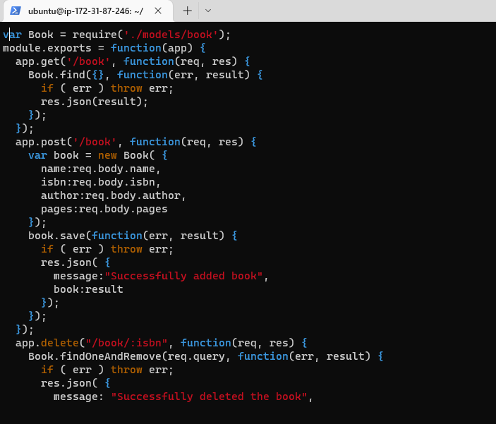
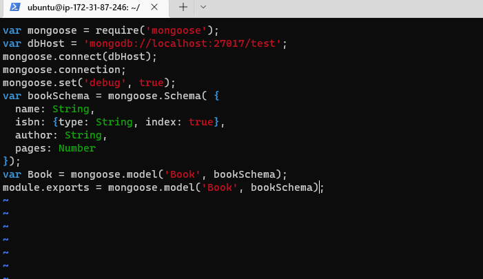
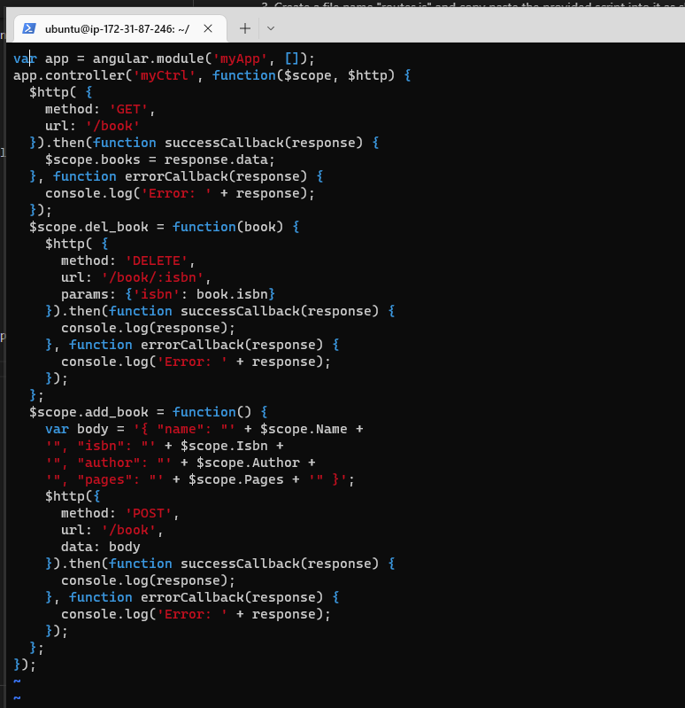
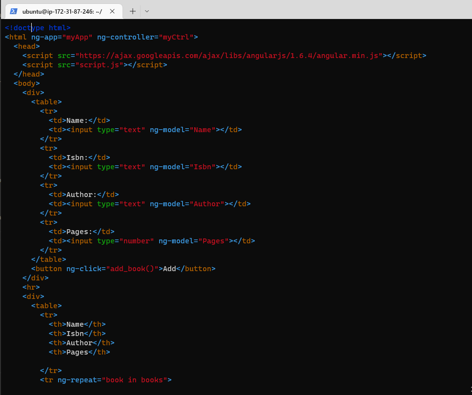
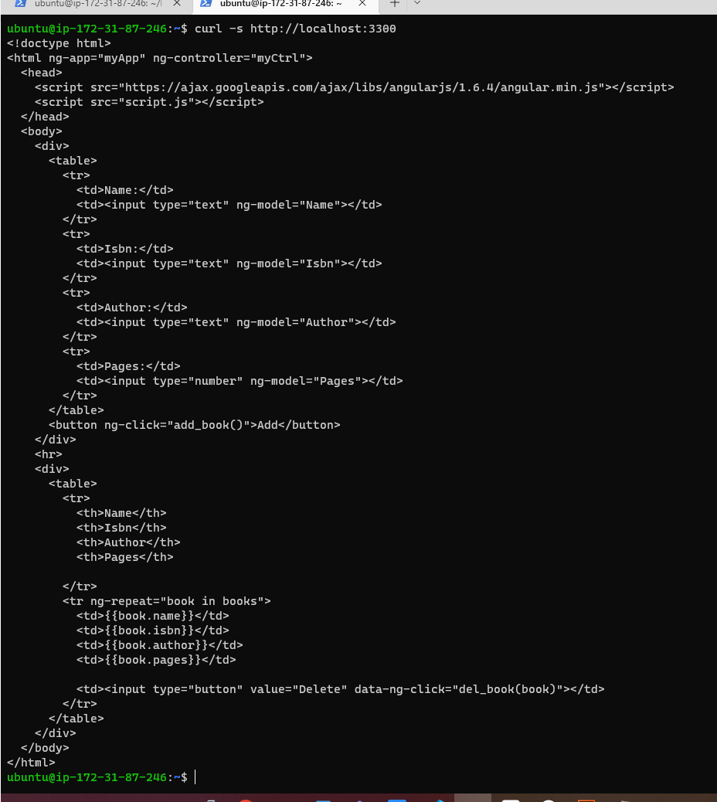
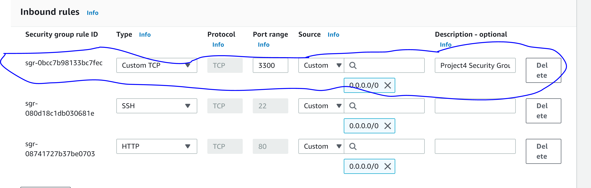
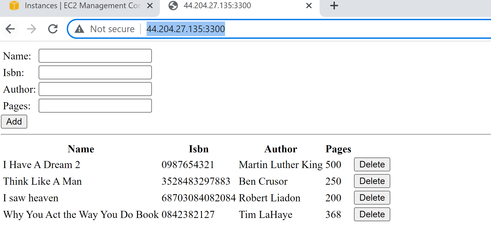

# DOCUMENTTION-Project 4
## Step1: Install NodeJs

1. Update and upgrade the Ubuntu inux Operating system

*sudo apt update* and *sudo apt upgrade*

2. Add certificate

 *sudo apt -y install curl dirmngr apt-transport-https lsb-release ca-certificates*

 *curl -sL https://deb.nodesource.com/setup_12.x | sudo -E bash -*

 3. Install NodeJS

     *sudo apt install -y nodejs*

## Step2: Install MongoDB, Node Package Manager and Body-Paser
# Note: The latest Ubuntu did not support the old Mongodb, therefore I installed the latest Mongodb 6.0 database.

1. Update the systtem and insytall the certificate

 *sudo apt update*
 *sudo apt install wget curl gnupg2 software-properties-common apt-transport-https ca-certificates lsb-release*

 2. Configure MongoDB Repo

 *echo "deb [ arch=amd64,arm64 ] https://repo.mongodb.org/apt/ubuntu focal/mongodb-org/6.0 multiverse" | sudo tee /etc/apt/sources.list.d/mongodb-org-6.0.list*

 3. Install MongoDB 6.0 on Ubuntu 22.04
 *wget http://archive.ubuntu.com/ubuntu/pool/main/o/openssl/libssl1.1_1.1.1f-1ubuntu2.16_amd64.deb*
 *sudo dpkg -i ./libssl1.1_1.1.1f-1ubuntu2.16_amd64.deb* 
 *sudo apt update*
 *sudo apt install mongodb-org*

 4. After installation of MongoDB, start and enable MongoDB. Also verify the MongoDB version
  *sudo systemctl enable --now mongod*
  *systemctl status mongod*

5.  Install npm - Node Package Manager
 *sudo apt install -y npm*
6. Install body-parser
 *sudo npm install body-parser*

7. Create a directory "Books" and initialize npm project
 *mkdir Books && cd Books*
 *npm init*

8. Create a file "server.js" inside  directory "Books" using  *vi editor*
 *vi server.js*
9. Paste the web server code into the "server.js" file as shown below

## Step 3: Install Express and Setup Routes to the Server

1. Install "Mongoose" to establish a schema for the database to store data of our book register
  *sudo npm install express mongoose*

2. Create a new folder called "apps" in "Book" folder and navigate to the newly created "app" folder with the command
 *mkdir apps && cd apps*

3. Create a file name "routes.js" and copy paste the provided script into it as shown below
   

4. In the "apps" folder create a folder called "models" 
  *mkdir models && cd models*

5. create a file name "books.js" inside the newly created folder "models"
 *vi book.js* 

 
 
 # step 4: Access the routes with Angular JS

 1. Create a new folder called "public" inside "Books" folder
    *mkdir public && cd public*

 2. Create a file "script.js" inside "public" folder and copy the script provided
    *vi scipt.js*
    

  3. Inside the "public" folder create a new file called "index.html" and copy the provided script into the "index.html" file
    

  4. Inside the main directory "Books" Start the server witht the command
     *node server.js*

  5. Check the running server with the "curl: command
     *curl -s http://localhost:3300*
    

  6. The TCP port 3300 is then open in the AWS Web console under the security group in the EC2 instance
    

  7. Access the Book Register web application from the internet using the AWS EC2 public address or the public DNS name
    